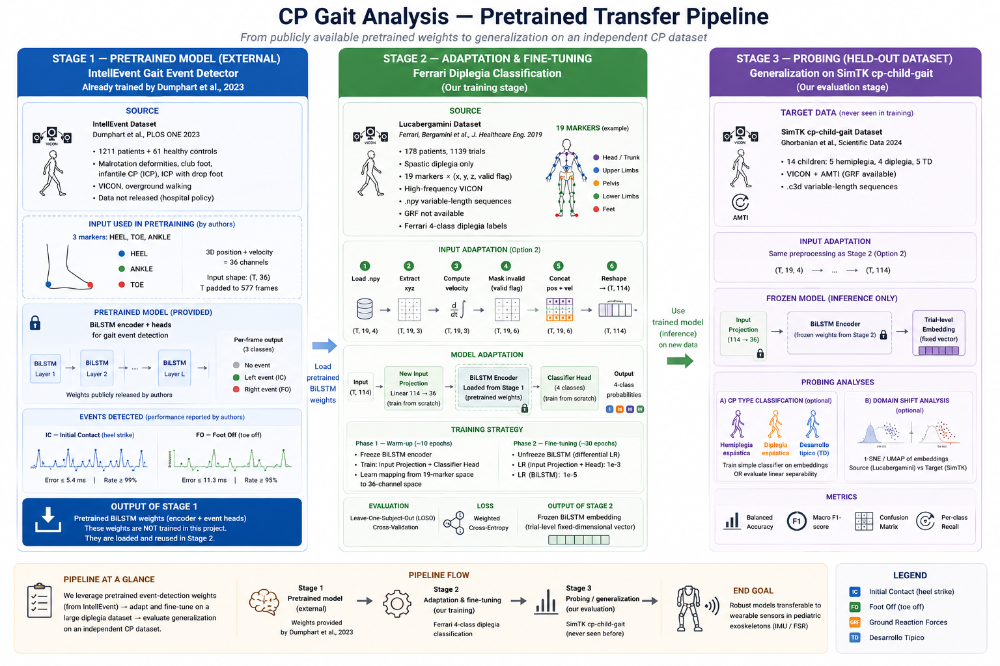

# Propuesta de modelado — `01_intellevent_to_ferrari`

## Descripción general

Esta propuesta plantea un pipeline de transferencia de aprendizaje en tres etapas para el análisis de marcha patológica en niños con parálisis cerebral (PC). La idea central es aprovechar dos grandes datasets VICON como dominios fuente para aprender representaciones temporales ricas de la marcha, y luego evaluar esas representaciones sobre un dataset independiente reservado para análisis exploratorio.

El pipeline evita deliberadamente la normalización del ciclo de marcha, preservando la dinámica temporal que los enfoques clásicos descartan.

---

## Etapa 1 — Preentrenamiento: IntellEvent

### Fuente

**IntellEvent** — Dumphart et al., *PLOS ONE* 2023  
`github.com/fhstp/IntellEvent` · `doi.org/10.1371/journal.pone.0288555`

### Datos de entrenamiento

| Propiedad | Valor |
|---|---|
| N | 1211 pacientes + 61 controles sanos |
| Institución | Orthopaedic Hospital Vienna-Speising, Austria |
| Patologías | Malrotación de miembros inferiores, pie zambo, PCI infantil, PCI con drop foot |
| Captura | VICON, marcha overground |
| Acceso | Datos no disponibles (política del hospital) |

### Arquitectura del modelo

Dos modelos BiLSTM independientes, uno por tipo de evento:

- **Entrada:** 3 marcadores — HEEL, TOE, ANKLE — posición 3D + velocidad → **36 canales**
- **Forma del tensor:** `(T, 36)` con padding hasta el trial más largo del conjunto de entrenamiento (577 frames)
- **Arquitectura:** LSTM bidireccional, múltiples capas
- **Salida:** Probabilidad por frame de 3 clases — sin evento / evento izquierdo / evento derecho
- **Post-procesamiento:** Detección de picos con umbral = 0.01

### Etiquetas

Supervisión temporal densa — una etiqueta por frame:

| Evento | Descripción | Error medio | Tasa de detección |
|---|---|---|---|
| IC — Initial Contact | Contacto inicial del talón con el suelo | ≤ 5.4 ms | ≥ 99% |
| FO — Foot Off | Despegue de los dedos del suelo | ≤ 11.3 ms | ≥ 95% |

### Propiedad clave para la transferencia

IntellEvent opera sobre **secuencias temporales crudas, sin normalización de ciclo de marcha**. El modelo no puede usar datos normalizados porque la detección de eventos es un prerequisito para la normalización — sería circular. Como resultado, el encoder preentrenado codifica dinámica temporal real: velocidad de marcha, cadencia, duración del ciclo y variabilidad entre ciclos. Estas son precisamente las features que la normalización clásica 0–100% descarta.

Los pesos preentrenados están disponibles públicamente y son el punto de partida para la Etapa 2.

---

## Etapa 2 — Fine-tuning: Clasificación Ferrari de diplejia

### Fuente

**Dataset Lucabergamini** — Ferrari, Bergamini et al., *J. Healthcare Engineering* 2019  
`github.com/lucabergamini/gait-analysis-dataset` · `doi.org/10.1155/2019/3796898`

### Datos de entrenamiento

| Propiedad | Valor |
|---|---|
| N | 178 pacientes, 1139 trials |
| Diagnóstico | Diplejia espástica (exclusivamente) |
| Institución | Hospital italiano |
| Captura | VICON de alta frecuencia |
| Marcadores | 19 marcadores × (x, y, z, flag de validez) |
| Formato | `.npy`, secuencias de longitud variable |
| GRF | No disponible |
| Etiquetas | Clasificación Ferrari de 4 clases |

### Conjunto de marcadores (19 marcadores)

| Marcador | Ubicación anatómica |
|---|---|
| C7 | 7.ª vértebra cervical |
| LA, RA | Acromion izquierdo / derecho |
| REP, LEP | Epicóndilo lateral de codo der. / izq. |
| RUL, LUL | Cúbito derecho / izquierdo (muñeca) |
| RASIS, LASIS | EIAS derecha / izquierda |
| RPSIS, LPSIS | EIPS derecha / izquierda |
| RGT, LGT | Trocánter mayor derecho / izquierdo |
| RLE, LLE | Epicóndilo lateral de rodilla der. / izq. |
| RCA, LCA | Calcáneo derecho / izquierdo |
| RFM, LFM | 5.º metatarsiano derecho / izquierdo |

### Etiquetas: clasificación Ferrari de 4 clases

Definida por Ferrari et al. (2005) a partir de la cinemática en el plano sagital. Todas las formas son diplejia espástica; difieren en la articulación dominante afectada y la estrategia de marcha.

| Forma | Nombre | Descripción clínica | Dificultad ML |
|---|---|---|---|
| I | Equino verdadero | Tobillo en flexión plantar durante todo el apoyo, caderas y rodillas extendidas, posible recurvatum | Fácil — patrón muy distintivo |
| II | Marcha en salto | Equino de tobillo + flexión de caderas y rodillas, flexión de rodilla en fase media de apoyo (signo sutil). La más frecuente (~35%) | Difícil — signo principal poco evidente |
| III | Equino aparente | ROM de tobillo normal, flexión excesiva de rodilla y cadera durante el apoyo — parece equino pero la causa es proximal | Moderada |
| IV | Marcha en cuclillas | Dorsiflexión excesiva + flexión de rodilla y cadera + tijeras. Forma más severa | Fácil — patrón muy severo |

**Desbalance de clases:** Forma II ≈ 35% de los pacientes. Las formas pueden solaparse parcialmente. La frontera más difícil es II vs III.

### Adaptación de la entrada (Opción 2 — capa de proyección)

IntellEvent usa 3 marcadores × 6 canales (posición + velocidad) = 36 canales. Lucabergamini provee 19 marcadores × 4 canales (posición + flag de validez). Para reutilizar los pesos preentrenados:

**Preprocesamiento por trial:**
1. Cargar `.npy` → forma `(T, 19, 4)`
2. Extraer posición `xyz` → `(T, 19, 3)`
3. Calcular velocidad por diferencias finitas → `(T, 19, 3)`
4. Enmascarar frames inválidos usando el flag (poner a cero posición y velocidad donde `valid = 0`)
5. Concatenar posición + velocidad → `(T, 19, 6)`
6. Aplanar → `(T, 114)`

**Adaptación del modelo:**
- Añadir una nueva **capa de proyección de entrada** `Linear(114 → 36)` entrenada desde cero
- Cargar los pesos BiLSTM preentrenados de IntellEvent en las capas recurrentes
- Añadir una **cabeza de clasificación** sobre el estado oculto final

**Entrenamiento en dos fases:**

*Fase 1 — calentamiento (~10 épocas):* Congelar el BiLSTM. Entrenar solo la proyección de entrada y la cabeza clasificadora. Permite que la proyección aprenda a mapear el espacio de 19 marcadores al espacio de 36 canales que espera el BiLSTM.

*Fase 2 — fine-tuning (~30 épocas):* Descongelar el BiLSTM con learning rates diferenciales:
- Proyección de entrada + cabeza clasificadora: `lr = 1e-3`
- BiLSTM: `lr = 1e-5`

**Evaluación:** Validación cruzada Leave-One-Subject-Out (LOSO). Cada sujeto se reserva por turno; el modelo se entrena con los 177 restantes y se evalúa sobre el sujeto reservado.

**Función de pérdida:** Entropía cruzada con pesos de clase para compensar el desbalance de la Forma II.

### Salida

El encoder fine-tuneado produce un **embedding latente por trial** — un vector de dimensión fija que codifica la representación aprendida del patrón de marcha del paciente. Este encoder es el artefacto central transferible del pipeline.

---

## Representación de la marcha: dos niveles de análisis

Una decisión de diseño clave es si analizar la marcha a nivel de **trial completo** o a nivel de **ciclo individual**. Ambos son válidos y responden preguntas distintas.

### Embedding de trial completo

Pasar el trial entero (todos los frames T) por el encoder → un vector de embedding por trial.

- Captura el patrón de marcha promedio del paciente
- Más adecuado para clasificación Ferrari y comparación entre datasets
- Limitación: la variabilidad intra-trial queda colapsada en un único punto

### Embedding por ciclo

Segmentar el trial en ciclos individuales usando los eventos IC detectados por IntellEvent (salida de la Etapa 1). Pasar cada ciclo por el encoder por separado → un vector de embedding por zancada.

- Captura la variabilidad zancada a zancada
- Permite análisis de asimetría izquierda/derecha — característica clínicamente relevante en PC
- Permite análisis de consistencia intra-paciente
- No requiere normalización — cada ciclo es una secuencia cruda de longitud variable

**El subproducto elegante:** los eventos IC y FO son una salida directa de la Etapa 1. La segmentación en ciclos no es un paso adicional — emerge naturalmente del modelo preentrenado.

### Nota sobre la normalización de ciclo (DTW / 0–100%)

El análisis clínico clásico normaliza cada ciclo a 100 puntos (0–100% del ciclo de marcha), usando opcionalmente Dynamic Time Warping (DTW) para alineación suave. Este enfoque:
- Permite comparar curvas de ángulos articulares entre pacientes y velocidades
- Es necesario para métricas clínicas clásicas (pico de flexión de rodilla en X% del ciclo)
- **Descarta** velocidad de marcha, cadencia, duración del ciclo y variabilidad rítmica

Este pipeline usa embeddings de secuencias crudas como representación principal. Las features normalizadas se pueden calcular en paralelo como baseline para cuantificar cuánta información aporta la dinámica temporal más allá de la forma del ciclo.

---

## Etapa 3 — Análisis de embeddings: SimTK (conjunto reservado)

### Datos de evaluación

**SimTK cp-child-gait** — `simtk.org/projects/cp-child-gait`

| Propiedad | Valor |
|---|---|
| N | 14 sujetos |
| Grupos | Hemiplejia n=5 (edad 9.0±2.3), Diplejia n=4 (edad 10.5±1.7), TD n=5 (edad 8.4±1.5) |
| Institución | Laboratorio diferente (Reino Unido) |
| Captura | VICON, Plug-in-Gait completo (39 marcadores) |
| GRF | Plataformas de fuerza AMTI × 2, embebidas en pasillo de 10 m |
| Formato | `.c3d` |
| Etiquetas | Subtipo de PC (hemi/diplejia/TD) — sin formas Ferrari |

### Por qué SimTK como conjunto de evaluación

SimTK es el dataset más diferente de los datos de entrenamiento en tres ejes:
- **Cambio de laboratorio:** Institución diferente, setup VICON diferente, frecuencia de captura diferente
- **Cambio de marcadores:** Plug-in-Gait de 39 marcadores vs subconjunto de 19 de Lucabergamini
- **Cambio de población:** Hemiplejia y controles sanos — ninguno presente en Lucabergamini (solo diplejia)

Esto lo convierte en una prueba honesta de generalización más que en un conjunto de test estándar.

### Adaptación de la entrada para SimTK

Mapear los 39 marcadores del Plug-in-Gait de SimTK al subconjunto de 19 marcadores usado en la Etapa 2, usando marcadores anatómicamente equivalentes cuando los nombres difieran. Calcular velocidades con el mismo esquema que en el preprocesamiento de la Etapa 2.

### Análisis

El encoder fine-tuneado (Etapa 2) se congela. No hay entrenamiento adicional.

**Extracción de embeddings:**
1. Preprocesar trials de SimTK → secuencias `(T, 114)`
2. Pasar por el encoder congelado → vector de embedding por trial
3. Opcionalmente extraer embeddings por ciclo usando los eventos IC de IntellEvent

**Reducción de dimensionalidad y visualización:**
- t-SNE y UMAP sobre el espacio de embeddings
- Color por grupo: hemiplejia / diplejia / TD

**Análisis cuantitativo:**
- Silhouette score — ¿qué tan bien separados están los tres grupos?
- Distancia inter-cluster vs intra-cluster
- Separabilidad lineal (regresión logística sobre los embeddings, leave-one-out)

### Pregunta abierta

> ¿Los embeddings entrenados sobre formas Ferrari de diplejia (Lucabergamini, hospital italiano) separan espontáneamente sujetos con hemiplejia / diplejia / TD de un laboratorio diferente (SimTK, Reino Unido)?

Posibles resultados y su interpretación:

| Resultado | Interpretación |
|---|---|
| Separación clara | El encoder aprendió una representación general de la marcha en PC más allá de las formas Ferrari específicas con las que fue entrenado |
| Diplejia ≈ hemiplejia, ambas separadas de TD | El encoder captura el contraste PC vs sano pero no el subtipo |
| Sin separación | La representación es específica del laboratorio / conjunto de marcadores; se necesita adaptación de dominio para generalizar |
| Diplejia separa de hemiplejia y TD | El encoder es específico de diplejia — útil para la tarea de clasificación pero no general |

Los cuatro resultados son informativos. El análisis se enmarca explícitamente como exploratorio.

---

## Resumen del desplazamiento de dominio

El desplazamiento de dominio está presente en cada transición entre etapas y debe reconocerse explícitamente.

| Transición | Laboratorio | Marcadores | Mix de patologías |
|---|---|---|---|
| Etapa 1 → Etapa 2 | Viena → Italia | 3 marcadores → 19 marcadores | Multi-patología → solo diplejia |
| Etapa 2 → Etapa 3 | Italia → Reino Unido | 19 marcadores → 39 marcadores (se usa subconjunto) | Diplejia → hemi + diplejia + TD |

La capa de proyección de entrada (Etapa 2) es el mecanismo principal para manejar el cambio de marcadores. El cambio de laboratorio se maneja implícitamente mediante el fine-tuning. El cambio de población en la Etapa 3 no se corrige — es precisamente lo que se mide.

---

## Resumen de datasets

| Dataset | Etapa | N | Tipo de PC | Marcadores VICON | GRF | Etiquetas | Acceso |
|---|---|---|---|---|---|---|---|
| IntellEvent | Preentrenamiento | 1211 | PCI, PCI+drop foot + otros | 3 (talón, punta, tobillo) | No | Eventos IC/FO (por frame) | Solo pesos |
| Lucabergamini | Fine-tuning | 178 | Diplejia espástica | 19 | No | 4 clases Ferrari | Abierto (.npy) |
| SimTK cp-child-gait | Análisis de embeddings | 14 | Hemi + diplejia + TD | 39 (Plug-in-Gait) | Sí (AMTI) | Subtipo de PC | Abierto (.c3d) |

---

---

## Referencias

1. Dumphart B, et al. (2023). Robust deep learning-based gait event detection across various pathologies. *PLOS ONE*, 18(8), e0288555. `doi.org/10.1371/journal.pone.0288555`
2. Ferrari A, Bergamini L, et al. (2019). Gait-based diplegia classification using LSTM networks. *Journal of Healthcare Engineering*, 2019, 3796898. `doi.org/10.1155/2019/3796898`
3. Bergamini L, et al. (2017). Signal processing and machine learning for diplegia classification. *ICIAP 2017*, LNCS 10485, 97–108.
4. Ferrari A, et al. (2008). The term diplegia should be enhanced. Part I: a new rehabilitation oriented classification of cerebral palsy. *European Journal of Physical and Rehabilitation Medicine*.
5. Rodda J, Graham HK. (2001). Classification of gait patterns in spastic hemiplegia and spastic diplegia. *European Journal of Neurology*, 8(s5), 98–108.
