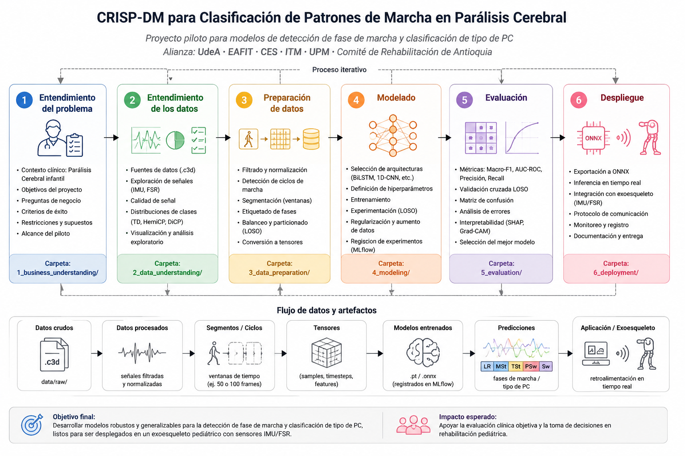

# Clasificación de Patrones de Marcha en Parálisis Cerebral

### Pipeline CRISP-DM 

> Proyecto piloto para el desarrollo de modelos de detección de fase de marcha y clasificación de tipo de PC, orientado a replicación en un exoesqueleto pediátrico con sensores IMU/FSR.
>
> **Alianza:** UdeA · EAFIT · CES · ITM · UPM · Comité de Rehabilitación de Antioquia

---

## Metodología

Este proyecto sigue la metodología **CRISP-DM** (Cross-Industry Standard Process for Data Mining), organizada en 6 fases iterativas:



| Fase | Carpeta | Descripción |
|------|---------|-------------|
| 1. Entendimiento del problema | `1_business_understanding/` | Contexto clínico, objetivos, criterios de éxito |
| 2. Entendimiento de los datos | `2_data_understanding/` | EDA, calidad de señal, distribuciones |
| 3. Preparación de datos | `3_data_preparation/` | Segmentación, etiquetado, tensores |
| 4. Modelado | `4_modeling/` | Arquitecturas, experimentos, hiperparámetros |
| 5. Evaluación | `5_evaluation/` | Métricas, validación cruzada, análisis de error |
| 6. Despliegue | `6_deployment/` | Inferencia en tiempo real, protocolo para el exoesqueleto |

Cada carpeta contiene su propio `README.md` con la documentación detallada de esa fase.

---

## Estructura del repositorio

```
cp-gait-crisp/
├── 1_business_understanding/
├── 2_data_understanding/
├── 3_data_preparation/
├── 4_modeling/
├── 5_evaluation/
├── 6_deployment/
├── data/
│   ├── raw/          ← Archivos .c3d originales (no versionados)
│   ├── processed/    ← Tensores y arrays listos para modelos
│   └── external/     ← Datasets complementarios
├── notebooks/
└── utils/
```

---

## Dataset

**SimTK `cp-child-gait`** — https://simtk.org/projects/cp-child-gait

Los archivos `.c3d` deben colocarse en `data/raw/` (no se incluyen en el repositorio por tamaño).

---

## Instalación

```bash
git clone https://github.com/<org>/cp-gait-crisp.git
cd cp-gait-crisp
pip install -r requirements.txt
```
